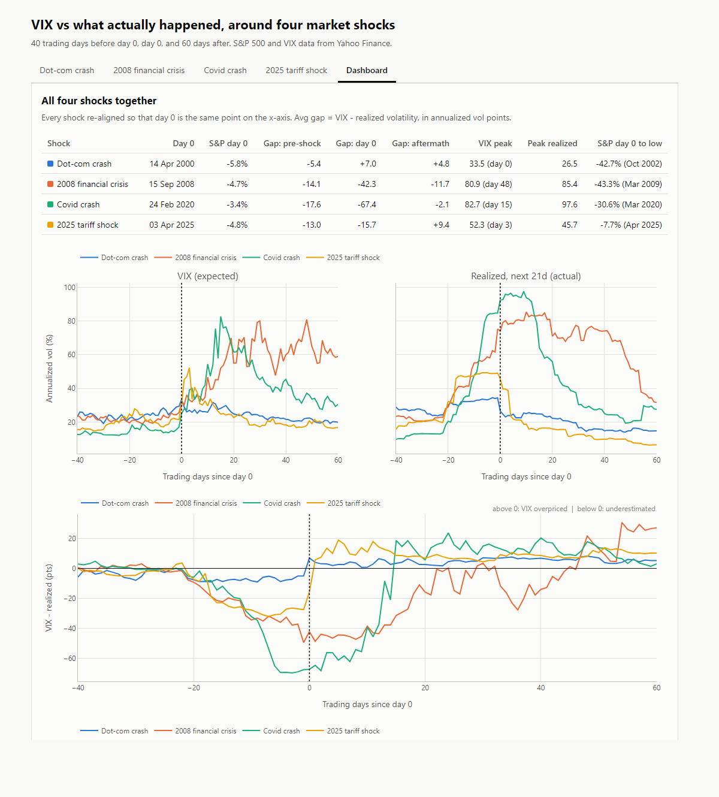

# Macro Quant Lab

A personal lab for testing ideas at the intersection of macroeconomics,
machine learning, and quantitative trading — a space to try things, break
things, and see what actually holds up.

## Featured: was the VIX right about four market shocks?

**[▶ Open the interactive dashboard](https://manucem.github.io/Macro-Quant-Lab/VIX/output/shocks.html)**

[](https://manucem.github.io/Macro-Quant-Lab/VIX/output/shocks.html)

The VIX is the market's ~30-day volatility forecast, built from S&P 500 option
prices. Each day's VIX is compared with the volatility that actually followed
over the next 21 trading days, around the dot-com crash, 2008, Covid and the
2025 tariff shock.

**Takeaway:** the VIX tracks volatility well (correlation ~0.7) and is above
realized volatility on ~84% of days (+3.8 pts on average — the price of
insurance). But it reacts to shocks rather than predicting them: it
underestimated the first weeks of 2008 and Covid, and overshot afterwards.

| Episode | Avg VIX | Avg realized | VIX − realized | Market | S&P, day 0 to low |
|---|---|---|---|---|---|
| Dot-com (2000–02) | 25.4 | 22.1 | +3.3 | Slightly overreacted | −42.7% |
| 2008 crisis | 48.8 | 53.0 | −4.2 | Underestimated | −43.3% |
| Covid 2020 | 41.4 | 48.0 | −6.6 | Underestimated | −30.6% |
| Tariff shock (Apr–mid-May 2025) | 28.4 | 21.8 | +6.6 | Overreacted | −7.7% |

Run it yourself:

```bash
pip install yfinance pandas numpy plotly
python VIX/volatility.py   # 30 years of VIX vs realized volatility + bias/RMSE
python VIX/shocks.py       # the four-shock dashboard (VIX/output/shocks.html)
```

## What's here

Each folder is a self-contained experiment:

- **VIX/** — the VIX vs realized volatility study above.
- **bond-30y/** — pulls 30-year Treasury yield data, engineers technical
  features, and predicts next-day direction (up/down), validated with
  time-series cross-validation.
- **sp500/** — same approach applied to the S&P 500 index, with added
  volume and Bollinger Band features.

More will be added as new ideas come up — this is a lab, not a finished product.

## How it runs

It's wired to an n8n + Telegram automation: a Telegram command triggers an n8n
workflow, which runs the script on a server, sends the raw output to an LLM for
interpretation, and replies back in Telegram. A sample of the n8n workflow
(credentials and IDs scrubbed) is included in this repo for reference.

For security, the workflow **never pulls code automatically**: updating the
server's copy of this repo is a manual step, done only after reviewing the
changes. An automatic `git pull` would mean a compromised repo = code
execution on the server. The bot also only answers one authorized Telegram
user, in private chat, with a cooldown between commands.

## Disclaimer

Personal research/learning project. Nothing here is investment advice.

## License

MIT — see [LICENSE](LICENSE).
